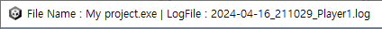

Unity Game Logger
======

Unity Engine을 사용한 게임 실행 시 발생하는 로그가 사라지지 않도록 도와주는 게임 런처입니다.
여러 버전의 게임을 동시에 등록 및 관리하여 QA 업무 진행 시 편리하게 빌드 파일과 로그 파일을 관리 할 수 있습니다.

# 1. 시작 가이드

## 1-1. 로그 저장 폴더를 감시할 수 있어요.

로그가 자동으로 저장되는 폴더를 감시하여 Player.log 파일이 삭제되는 것을 방지합니다.

## 1-2. 버전 별로 파일을 관리하세요.

Unity Game Logger를 사용하여 게임을 실행하세요.
자동 저장 폴더가 아닌 게임 폴더에 각각 저장이 되어 편하게 로그 관리가 가능합니다.
텍스트 박스에 간단히 메모도 저장이 가능합니다.

프로젝트 이름을 먼저 작성해주세요.
여러 클라이언트를 실행 시 섞이는 것을 방지하여 게임 창 이름을 로그 파일 이름과 함께 변경해줍니다.

## 1-3. Android 기기 로그를 간단하게 추출하세요.

Android 기기에 설치한 게임의 로그를 버튼 하나만으로 간단히 추출과 초기화를 할 수 있습니다.

*이 기능은 [Android Debug Bridge](https://developer.android.com/tools/adb) 명령어를 사용합니다.*

# 2. PC 기능

## 2-1. Player.log 자동 삭제 방지

로그 설정 폴더 메뉴를 사용하여 감시 경로를 설정 시 Player-prev.log 파일을 감지하여 해당 파일이 생길 때 마다 이름을 변경하여 자동 삭제를 방지합니다.
변경된 파일 이름은 **마지막 로그 시간을 기준**으로 {yyyy-MM-dd_HHmmss}_Player.log로 파일 이름을 변경합니다.

## 2-2. 여러 버전 관리

**Unity Game Logger**를 사용하여 게임 실행 시 빌드 폴더 내 로그 폴더를 생성합니다.
빌드 폴더에 로그를 직접 저장하며 **실행 시간을 기준**으로 {yyyy-MM-dd_HHmmss}_Player.log로 로그 파일을 저장합니다.

또한, 작성한 프로젝트 이름을 참조하여 게임 창 이름을 로그 파일 이름과 함께 변경합니다.

게임 파일 명 하단 텍스트 박스에 어떤 용도의 빌드인지 간단하게 메모를 작성할 수 있습니다.

# 3. Android 기능

Android 기능은 [Android Debug Bridge](https://developer.android.com/tools/adb)와 [scrcpy](https://github.com/Genymobile/scrcpy)를 사용합니다.
UnityGameLogger/scrcpy 경로의 파일을 참조합니다.
해당 파일이 없을 경우 Android 기능이 정상적으로 실행되지 않을 수 있습니다.

USB 디버그 모드가 켜져 있는 Andorid 기기를 연결 시 자동으로 인식하여 시리얼 번호를 출력합니다.
자동 인식이 되지 않는다면 **수동 검색 버튼**을 눌러 재검색이 가능합니다.

## 3-1. Android 기기 로그 추출 및 초기화

USB 디버그 모드가 켜져있는 Android 기기를 연결하여 일반 로그와 Unity 로그를 추출해주는 기능을 가지고 있습니다. Andorid 로그 폴더는 프로그램 내 Android-LOG 폴더 내 저장됩니다.

*이 기능은 [Android Debug Bridge](https://developer.android.com/tools/adb) 명령어를 사용합니다.*

## 3-2. Android 기기 PC 송출

USB 디버그 모드가 켜져있는 Android 기기를 연결하여 화면과 실시간 Unity 로그를 띄워줍니다.

*이 기능은 [Android Debug Bridge](https://developer.android.com/tools/adb)와 [scrcpy](https://github.com/Genymobile/scrcpy)를 사용합니다.*

# 라이센스

    Copyright (C) 2024 Sero Lee
    
    Licensed under the Apache License, Version 2.0 (the "License");
    you may not use this file except in compliance with the License.
    You may obtain a copy of the License at

        http://www.apache.org/licenses/LICENSE-2.0

    Unless required by applicable law or agreed to in writing, software
    distributed under the License is distributed on an "AS IS" BASIS,
    WITHOUT WARRANTIES OR CONDITIONS OF ANY KIND, either express or implied.
    See the License for the specific language governing permissions and
    limitations under the License.